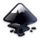

# arqvector.github.io

[arqvector.github.io](https://arqvector.github.io)

[Ínicio](https://arqvector.github.io/www/index.html)

[Munsell](https://arqvector.github.io/www/munsell/munsell.html)

[Munsell real](https://arqvector.github.io/www/munsell/munsell_real.html)

------

* [Início](#arqvector-)

* [Arqueologia & Património](#arqueologiapatrimónio-)

* [Desenho; Fotografia; Base de Dados](#desenho-fotografia-base-de-dados-)

* [Sistemas de Informação Geográfica](#sistemas-de-informação-geográfica-)

* [Fotogrametria e 3D](#fotogrametria-e-3d-)

* [Divulgação 3D](#divulgação-3d-)

* [Cores de Munsell](#cores-de-munsell-)

* [Matriz - Graphviz](#matriz---graphviz-)

* [Outros](#outros-)

* [Exemplos](#exemplos-)

------

# ARQVECTOR 

### Arqueologia, Património, Sistemas de Informação Geográfica, Fotogrametria, 3D 

Trabalhamos com diversas tecnologias de código aberto (gratuitas) aplicadas ao património e em particular ao património arqueológico.

Os trabalho que produzimos é desenvolvido com recurso a programas de código aberto no sentido de facilitar/fomentar o seu uso, numa óptica de entre ajuda.

Este projecto pretende ir ao encontro do RNID – Regulamento Nacional de Interoperabilidade Digital – [Decreto-Lei n.º 83/2018](https://dre.pt/application/conteudo/116734769) ([ver mais ANSOL](https://ansol.org/normasabertas/rnid)).  
Este regulamento “alarga o âmbito de aplicação da Lei n.º 36/2011, de 21 de junho, que estabelece a adoção de normas abertas nos sistemas informáticos do Estado, à Administração Pública local e a funções consideradas essenciais, no que diz respeito à acessibilidade do conteúdo de sítios web e de aplicações móveis”.

## Arqueologia & Património 

- Desenho
- Fotografia
- Base de Dados
- Sistemas de Informação Geográfica
- Fotogrametria
- 3D
- Cores de Munsell
- Matriz - Graphviz

## Desenho; Fotografia; Base de Dados 

|                                             |                                                                            |
| ------------------------------------------- | -------------------------------------------------------------------------- |
| » [Inkscape](https://inkscape.org/pt/)      |       |
| » [GIMP](https://www.gimp.org/)             |              |
| » [PostgreSQL](https://www.postgresql.org/) |  |

## Sistemas de Informação Geográfica 

|                                             |                                                                            |
| ------------------------------------------- | -------------------------------------------------------------------------- |
| » [OSGeo](https://www.osgeo.org/)           |                  |
| » [QGIS](https://qgis.org/)                 |                      |
| » [PostgreSQL](https://www.postgresql.org/) |  |
| » [PostGIS](https://postgis.net/)           |                  |
| » [Lizmap](https://www.lizmap.com/)         |          |
| » [MapGuide](https://mapguide.osgeo.org/)   |    |
| » [GDAL](https://gdal.org/)                 |                  |

## Fotogrametria e 3D 

|                                                |                                                                           |
| ---------------------------------------------- | ------------------------------------------------------------------------- |
| » [Visual SFM](http://ccwu.me/vsfm/)           |  |
| » [MeshLab](http://www.meshlab.net/)           |         |
| » [CloudCompare](https://www.danielgm.net/cc/) |        |

## Divulgação 3D 

|                                                |                                                                               |
| ---------------------------------------------- | ----------------------------------------------------------------------------- |
| » [Sketchfab](https://sketchfab.com/arqvector) |  |

----

# Cores de Munsell 
https://munsell.com/faqs/list-of-colors-by-notation-name/
----

# Matriz - Graphviz 

[edotor.net](https://edotor.net/)

[graphviz-visual-editor](http://magjac.com/graphviz-visual-editor/)

----
# Outros 

[WebODM](https://github.com/OpenDroneMap/WebODM)
[install Web OpenDroneMap (WebODM)](https://www.hatarilabs.com/ih-en/how-to-install-web-opendronemap-webodm-in-windows-with-docker)

[ILIUM](http://www.ilium.archaeologica.eu.org/index.html)
"ILIUM é um software científico para coletar, padronizar, visualizar, analisar e exportar dados arqueológicos, sejam provenientes de escavações ou coletados durante estudos arquitetônicos em elevação (ou seja, "estratigrafia vertical" em alguns países)."

[ARK](https://ark.lparchaeology.com/about/ARK)
The Archaeological Recording Kit) é um 'kit de ferramentas' baseado na web para a coleta, armazenamento e disseminação de dados arqueológicos. Inclui ferramentas de edição e criação de dados, visualização de dados e compartilhamento de dados, todas entregues por meio de um front-end baseado na web.

[ArchAIDE Desktop](https://archaide-desktop.inera.it/home)
O site ArchAIDE Desktop é o local onde parte os resultados do Projeto ArchAIDE são disponibilizados para a comunidade da Internet. Em particular, aqui você pode encontrar: a base de conhecimento (catálogos de formas de cerâmica, decorações e selos) usada como referência na classificação de cerâmica, a ferramenta de reconhecimento de imagem para classificar decorações em fragmentos de cerâmica, a ferramenta de reconhecimento de forma para identificar a forma para a que pertence um caco de cerâmica, a ferramenta de busca de selos para identificar os selos e, por último, mas não menos importante, as ferramentas de visualização de dados para analisar as informações de origem-ocorrência coletadas pelo projeto.
[https://github.com/barak-itkin/archaide-software](https://github.com/barak-itkin/archaide-software)

[ishtar-archeo.net](https://ishtar-archeo.net/)
"Étienne Loks, cofundador da Iggdrasil, é o principal desenvolvedor do software Ishtar, software de gestão de dados arqueológicos e inventário, sob licença AGPL. Ishtar é um projeto de base de dados que visa gerir dados e documentação (incluindo móveis) de intervenções arqueológicas, garantindo a máxima rastreabilidade das informações.
Consulte o site da comunidade para obter mais informações: https://ishtar-archeo.net.
A Iggdrasil oferece diversos serviços (hospedagem, assistência, treinamento, desenvolvimento) em torno do software." in https://www.iggdrasil.net/

----
# Exemplos 

## Dados Abertos

### Raster

[gridded_bathymetry_data](https://www.gebco.net/data_and_products/gridded_bathymetry_data/)

[gebco](https://download.gebco.net/)

## QGIS

[QGIS - Geometry Generator](https://gitlab.com/GIS-projects/qgis-geometry-generator-examples)

## PostgreSQL | PostGIS

### PostGIS Raster

[PostGIS Raster](https://github.com/lcalisto/workshop-postgis-raster)

[Calculos DEM](http://themagiscian.com/2016/11/28/dem-slope-calculations-bicycle-routing-postgis/)

### Recursivo

[postgresql_recursive.sql](https://gist.github.com/dankrause/76baa0ad73ff19fd39e861600c56a15d)
