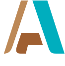

# arqvector.github.io

[arqvector.github.io](https://arqvector.github.io)

[Ínicio](https://arqvector.github.io/www/index.html)

[Munsell](https://arqvector.github.io/www/munsell/munsell.html)

[Munsell real](https://arqvector.github.io/www/munsell/munsell_real.html)

[Dados do portal leng.pt](https://arqvector.github.io/data/lneg/)

------

* [Início](#arqvector-)

* [Arqueologia & Património](#arqueologiapatrimónio-)

* [Desenho; Fotografia; Base de Dados](#desenho-fotografia-base-de-dados-)

* [Sistemas de Informação Geográfica](#sistemas-de-informação-geográfica-)

* [Fotogrametria e 3D](#fotogrametria-e-3d-)

* [Divulgação 3D](#divulgação-3d-)

* [Cores de Munsell](#cores-de-munsell-)

* [Matriz - Graphviz](#matriz---graphviz-)

* [Outros](#outros-)

* [Exemplos](#exemplos-)

------

# ARQVECTOR 

### Arqueologia, Património, Sistemas de Informação Geográfica, Fotogrametria, 3D 

Trabalhamos com diversas tecnologias de código aberto (gratuitas) aplicadas ao património e em particular ao património arqueológico.

Os trabalho que produzimos é desenvolvido com recurso a programas de código aberto no sentido de facilitar/fomentar o seu uso, numa óptica de entre ajuda.

Este projecto pretende ir ao encontro do RNID – Regulamento Nacional de Interoperabilidade Digital – [Decreto-Lei n.º 83/2018](https://dre.pt/application/conteudo/116734769) ([ver mais ANSOL](https://ansol.org/normasabertas/rnid)).  
Este regulamento “alarga o âmbito de aplicação da Lei n.º 36/2011, de 21 de junho, que estabelece a adoção de normas abertas nos sistemas informáticos do Estado, à Administração Pública local e a funções consideradas essenciais, no que diz respeito à acessibilidade do conteúdo de sítios web e de aplicações móveis”.

## Arqueologia & Património 

- Desenho
- Fotografia
- Base de Dados
- Sistemas de Informação Geográfica
- Fotogrametria
- 3D
- Cores de Munsell
- Matriz - Graphviz

## Arqueologia

|                                             | Logotipos                                                                  | Descrição                                   |
| ------------------------------------------- | -------------------------------------------------------------------------- | ------------------------------------------- |
| [ARK](https://ark.lparchaeology.com/about/ARK) |  | "The Archaeological Recording Kit) é um 'kit de ferramentas' baseado na web para a coleta, armazenamento e disseminação de dados arqueológicos. Inclui ferramentas de edição e criação de dados, visualização de dados e compartilhamento de dados, todas entregues por meio de um front-end baseado na web." |
| [ArchAIDE Desktop](https://archaide-desktop.inera.it/home) |  | "O site ArchAIDE Desktop é o local onde parte os resultados do Projeto ArchAIDE são disponibilizados para a comunidade da Internet. Em particular, aqui pode encontrar: a base de conhecimento (catálogos de formas de cerâmica, decorações e selos) usada como referência na classificação de cerâmica, a ferramenta de reconhecimento de imagem para classificar decorações em fragmentos de cerâmica, a ferramenta de reconhecimento de forma para identificar a forma para a que pertence um caco de cerâmica, a ferramenta de busca de selos para identificar os selos e, por último, mas não menos importante, as ferramentas de visualização de dados para analisar as informações de origem-ocorrência coletadas pelo projeto. [https://github.com/barak-itkin/archaide-software](https://github.com/barak-itkin/archaide-software)" |
| [ishtar-archeo.net](https://ishtar-archeo.net/) |  | "Étienne Loks, cofundador da Iggdrasil, é o principal desenvolvedor do software Ishtar, software de gestão de dados arqueológicos e inventário, sob licença AGPL. Ishtar é um projeto de base de dados que visa gerir dados e documentação (incluindo móveis) de intervenções arqueológicas, garantindo a máxima rastreabilidade das informações." Consulte o site da comunidade para obter mais informações: https://ishtar-archeo.net. "A Iggdrasil oferece diversos serviços (hospedagem, assistência, treino, desenvolvimento) em torno do software." in https://www.iggdrasil.net/ |
| [ILIUM](http://www.ilium.archaeologica.eu.org/index.html) |  | "ILIUM é um software científico para recolher, padronizar, visualizar, analisar e exportar dados arqueológicos, sejam provenientes de escavações ou de arqueologia da arquitectura." |

## Desenho; Fotografia; Base de Dados 

|                                             | Logotipos                                                                  | Descrição                                   |
| ------------------------------------------- | -------------------------------------------------------------------------- | ------------------------------------------- |
| » [Inkscape](https://inkscape.org/pt/)      |       | "O Inkscape é programa de gráficos vectoriais de qualidade profissional que corre no Windows, Mac OS X e Linux. É utilizado por profissionais e amadores em todo o mundo, para criar um alargado leque de gráficos como ilustrações, ícones, logótipos, diagramas, mapas e gráficos para páginas da internet. O Inkscape utiliza o standard livre SVG (Scalable Vector Graphics) da W3C como formato nativo, e é um programa gratuito e de código livre." |
| » [GIMP](https://www.gimp.org/)             |              | "GIMP é um editor de imagens de plataforma cruzada disponível para GNU/Linux, OS X, Windows e mais sistemas operativos. Quer seja um designer gráfico, fotógrafo, ilustrador ou cientista, o GIMP fornece ferramentas sofisticadas para realizar seu trabalho. Pode aumentar ainda mais sua produtividade com o GIMP graças a muitas opções de personalização e plug-ins de terceiros." |
| » [PostgreSQL](https://www.postgresql.org/) |  | "PostgreSQL é um poderoso sistema de base de dados relacional de objeto de código aberto com mais de 30 anos de desenvolvimento ativo que lhe rendeu uma forte reputação de confiabilidade, robustez de recursos e desempenho." |

## Sistemas de Informação Geográfica 

|                                             | Logotipos                                                                  | Descrição                                   |
| ------------------------------------------- | -------------------------------------------------------------------------- | ------------------------------------------- |
| » [OSGeo](https://www.osgeo.org/)           |                  | "A Open Source Geospatial Foundation (OSGeo) é uma organização sem fins lucrativos cuja missão é promover a adoção global da tecnologia geoespacial aberta, sendo uma fundação de software inclusiva com uma filosofia aberta e ao desenvolvimento participativo dirigido pela comunidade." |
| » [QGIS](https://qgis.org/)                 |                      | "Um Sistema de Informação Geográfica livre e aberto" |
| » [PostgreSQL](https://www.postgresql.org/) |  | "PostgreSQL é um poderoso sistema de base de dados relacional de objeto de código aberto com mais de 30 anos de desenvolvimento ativo que lhe rendeu uma forte reputação de confiabilidade, robustez de recursos e desempenho." |
| » [PostGIS](https://postgis.net/)           |                  | "PostGIS é um extensor de base de dados espacial para base de dados objeto-relacional PostgreSQL. Adiciona suporte para objetos geográficos, permitindo que consultas de localização sejam executadas em SQL." |
| » [Lizmap](https://www.lizmap.com/)         |          | "Lizmap é um software de código aberto, desenvolvido pela 3Liz, que pode instalar em casa ou hospedar num servidor. Crie aplicações cartográficas para a web com QGIS® e Lizmap. O Lizmap permite a partir do QGIS® criar aplicações web cartográficas. Podem ser simples para a publicação de um mapa destinado ao público em geral ou de trabalho de produção" |
| » [MapGuide](https://mapguide.osgeo.org/)   |    | "MapGuide Open Source é uma plataforma baseada na web que permite aos utilizadores desenvolver e implementar aplicações de mapeamento da web e serviços geoespaciais da web. O MapGuide apresenta um visualizador interativo que inclui suporte para seleção de recursos, inspeção de propriedades, dicas de mapa e operações como buffer, seleção interna e medição. O MapGuide inclui uma base de dados XML para gerir conteúdo e oferece suporte aos formatos, base de dados e padrões de ficheiros geoespaciais mais populares. O MapGuide pode ser implantado em Linux ou Windows, oferece suporte a servidores da Web Apache e IIS e oferece extensas APIs de PHP, .NET, Java e JavaScript para desenvolvimento de aplicações. O MapGuide Open Source é licenciado pela LGPL." |
| » [GDAL](https://gdal.org/)                 |                  | "GDAL é uma biblioteca de tradução para formatos de dados geoespaciais raster e vetoriais que é lançada sob uma Licença de Código Aberto do estilo X / MIT pela Open Source Geospatial Foundation. Como uma biblioteca, ela apresenta um único modelo de dados abstratos de rasterização e um único modelo de dados abstratos de vetor para a aplicação de chamada para todos os formatos suportados. Também vem com uma variedade de utilitários de linha de comando úteis para tradução e processamento de dados." |
| » [Geosetter](https://geosetter.de/)        |               | "GeoSetter é uma ferramenta freeware para Windows (requer Internet Explorer 10 ou superior) para mostrar e alterar dados geográficos e outros metadados (IPTC / XMP / Exif) de ficheiros de imagem (por exemplo, imagens tiradas por máquinas digitais)." |

## Fotogrametria e 3D 

|                                                | Logotipos                                                                 | Descrição                                   |
| ---------------------------------------------- | ------------------------------------------------------------------------- | ------------------------------------------- |
| » [Visual SFM](http://ccwu.me/vsfm/)           |  | "VisualSFM é uma aplicação GUI para reconstrução 3D usando estrutura de movimento (SFM). O sistema de reconstrução integra vários projetos: SIFT na GPU (SiftGPU) , Ajuste de pacote multicore e Rumo à estrutura incremental de tempo linear a partir do movimento. O VisualSFM é executado rapidamente, explorando o paralelismo de vários núcleos para detecção de recursos, correspondência de recursos e ajuste de pacote." |
| » [MeshLab](http://www.meshlab.net/)           |         | "MeshLabo sistema de código aberto para processamento e edição de malhas triangulares 3D. Fornece um conjunto de ferramentas para edição, limpeza, correção, inspeção, renderização, texturização e conversão de malhas. Oferece recursos para o processamento de dados brutos produzidos por ferramentas/dispositivos de digitalização 3D e para a preparação de modelos para impressão 3D." |
| » [CloudCompare](https://www.danielgm.net/cc/) |        | "CloudCompare e ccViewer atualmente rodam em Windows, macOS e Linux. É livre para usá-los para qualquer finalidade, incluindo comercial ou educacional. Essa liberdade está definida pela GNU General Public License (GPL)." |

## Divulgação 3D 

|                                                | Logotipos                                                                     | Descrição                                   |
| ---------------------------------------------- | ----------------------------------------------------------------------------- | ------------------------------------------- |
| » [Sketchfab](https://sketchfab.com/arqvector) |  | "Distribua experiências 3D e AR. Colabore com outras pessoas. Mostre seu trabalho." |

----

# Cores de Munsell 
https://munsell.com/faqs/list-of-colors-by-notation-name/
----

# Matriz - Graphviz 

[edotor.net](https://edotor.net/)

[graphviz-visual-editor](http://magjac.com/graphviz-visual-editor/)

----
# Outros 

[WebODM](https://github.com/OpenDroneMap/WebODM)
[install Web OpenDroneMap (WebODM)](https://www.hatarilabs.com/ih-en/how-to-install-web-opendronemap-webodm-in-windows-with-docker)

----
# Exemplos 

## Dados Abertos

### Raster

[gridded_bathymetry_data](https://www.gebco.net/data_and_products/gridded_bathymetry_data/)

[gebco](https://download.gebco.net/)

## QGIS

[QGIS - Geometry Generator](https://gitlab.com/GIS-projects/qgis-geometry-generator-examples)

## PostgreSQL | PostGIS

### PostGIS Raster

[PostGIS Raster](https://github.com/lcalisto/workshop-postgis-raster)

[Calculos DEM](http://themagiscian.com/2016/11/28/dem-slope-calculations-bicycle-routing-postgis/)

### Recursivo

[postgresql_recursive.sql](https://gist.github.com/dankrause/76baa0ad73ff19fd39e861600c56a15d)

### Leaflet
http://www.gistechsolutions.com/leaflet/DEMO/
