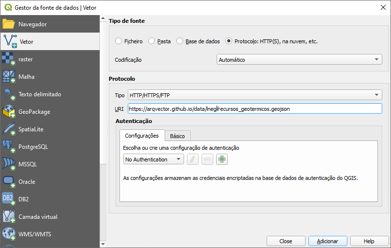

# Dados do portal [leng.pt](https://geoportal.lneg.pt)

---

## Dados abertos

Conectar aos dados dados através dos links na página

https://geoportal.lneg.pt/pt/dados_abertos/servicos_wms/

---

## Alternativa - conectar aos dados GeoJSON

Exemplo com o [QGIS](https://www.qgis.org/)

### Recursos Geotérmicos

[recursos_geotermicos.geojson](https://github.com/arqvector/arqvector.github.io/blob/main/data/lneg/recursos_geotermicos.geojson "recursos_geotermicos.geojson")
