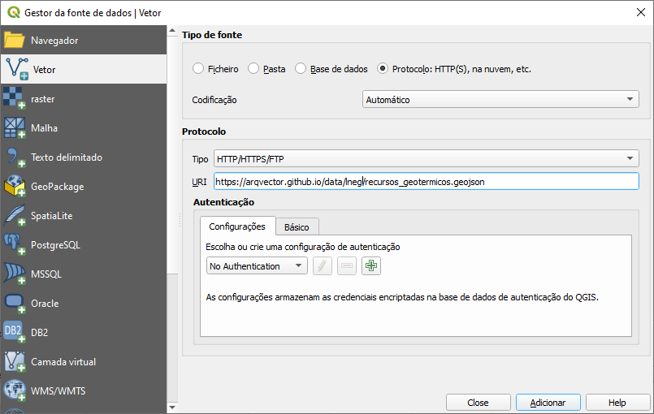

# Dados do portal [leng.pt](https://geoportal.lneg.pt)

---

## [Dados abertos](#serviços-wms)

Conectar aos dados dados através dos links na página

https://geoportal.lneg.pt/pt/dados_abertos/servicos_wms/

---

## Alternativa - conectar aos dados GeoJSON

Exemplo com o [QGIS](https://www.qgis.org/)

### Recursos Geotérmicos

[recursos_geotermicos.geojson](https://github.com/arqvector/arqvector.github.io/blob/main/data/lneg/recursos_geotermicos.geojson "recursos_geotermicos.geojson")

[Link para qgis](https://arqvector.github.io/data/lneg/recursos_geotermicos.geojson)

---

# Serviços WMS

Conjunto de Serviços de Dados WMS que permitem a visualização de mapas do LNEG de forma dinâmica.

---

### Geologia

Carta Geológica de Portugal, na escala 1:1 000 000

https://sig.lneg.pt/server/services/CGP1M/MapServer/WMSServer

Carta Geológica de Portugal, na escala 1:500 000

https://sig.lneg.pt/server/services/CGP500k/MapServer/WMSServer

Carta Geológica de Portugal, na escala 1:200 000 (raster)

https://sig.lneg.pt/server/services/CGP200k/MapServer/WMSServer

Carta Geológica de Portugal, na escala 1:200 000 (vetor)

https://sig.lneg.pt/server/services/CGP200k_vetor/MapServer/WMSServer

Carta Geológica da região do Algarve, na escala 1:100 000

https://sig.lneg.pt/server/services/CGP100k_Algarve/MapServer/WMSServer

Carta Geológica de Portugal, na escala 1:50 000 (raster)

https://sig.lneg.pt/server/services/CGP50k/MapServer/WMSServer

Inventário de Sítios com Interesse Geológico - Geo-Sítios

https://sig.lneg.pt/server/services/Geositios/MapServer/WMSServer

Base de Dados de Sondagens - Sondabase

https://sig.lneg.pt/server/services/Sondabase/MapServer/WMSServer

Carta Geológica da República da Guiné-Bissau

https://sig.lneg.pt/server/services/CartaGuine/MapServer/WMSServer

Carta Geológica Simplificada do Arquipélago da Madeira, na escala 1:80 000

https://sig.lneg.pt/server/services/CartaMadeira/MapServer/WMSServer

Carta Geológica do Concelho de Lisboa, na escala 1:10 000

https://sig.lneg.pt/server/services/CartaLisboa/MapServer/WMSServer

Mapa Geológico Simplificada do Município de Góis

https://sig.lneg.pt/server/services/GeologiaGois/MapServer/WMSServer

Mapa Geológico de Espanha e Portugal à escala 1:1 000 000

https://sig.lneg.pt/server/services/MGEP_1M/MapServer/WMSServer

---

### Recursos Minerais

Carta de Depósitos Minerais da Região Norte de Portugal

https://sig.lneg.pt/server/services/CartaDepositosMinerais_Norte/MapServer/WMSServer

Ocorrências e Recursos Minerais Portugueses - SIORMINP

https://sig.lneg.pt/server/services/OcorrenciasMinerais/MapServer/WMSServer

Base de Dados do Museu de Jazigos Minerais Portugueses

https://sig.lneg.pt/server/services/JazigosMinerais/MapServer/WMSServer

Áreas Potenciais para Rochas e Minerais não Metálicos

https://sig.lneg.pt/server/services/RochasOrnamentais/MapServer/WMSServer

Matérias Primas Minerais na Indústria Cerâmica - CERAM

https://sig.lneg.pt/server/services/Ceram/MapServer/WMSServer

Carta Radiométrica de Portugal Continental

https://sig.lneg.pt/server/services/CartaRadiometrica/MapServer/WMSServer

Carta de Recursos Argilosos da Orla Ocidental

https://sig.lneg.pt/server/services/CartaRecursosArgilosos/MapServer/WMSServer

Carta de Ocorrências Minerais de Portugal Continental, na escala 1:250 000

https://sig.lneg.pt/server/services/OcorrenciasMinerais_250k/MapServer/WMSServer

Carta de Ocorrências Minerais de Portugal Continental, escala 1:500 000

https://sig.lneg.pt/server/services/OcorrenciasMinerais_500k/MapServer/WMSServer

Carta de Concessões Mineiras de Portugal (1836-1992)

https://sig.lneg.pt/server/services/ConcessoesMineiras/MapServer/WMSServer

Áreas de Prospeção e Pesquisa Atribuídas a Empresas Mineiras (1955-2003)

https://sig.lneg.pt/server/services/AreasProspecaoPesquisa/MapServer/WMSServer

Mapa Geológico dos Recursos em Xisto da Pedreira do Mestre André, Barrancos (2001)

https://sig.lneg.pt/server/services/PedreiraMestreAndre/MapServer/WMSServer

Mapa Geológico do Anticlinal de Estremoz

https://sig.lneg.pt/server/services/CartaAnticlinalEstremoz/MapServer/WMSServer

Mapa Geológico da Brecha Algarvia

https://sig.lneg.pt/server/services/BrechaAlgarvia/MapServer/WMSServer

Cartografia Geológica dos Mármores de Viana do Alentejo - Alvito (1999)

https://sig.lneg.pt/server/services/MarmoresVianaAlvito/MapServer/WMSServer

Geologia dos Núcleos de Exploração de Mármore do Anticlinal de Estremoz (2003-2008)

https://sig.lneg.pt/server/services/NucleosMarmoreAnticlinalEstremoz/MapServer/WMSServer

Mapa de Depósitos de Matérias Primas Críticas em Portugal Continental - CRM2020

https://sig.lneg.pt/server/services/CRM2020/MapServer/WMSServer

---

### Energia

Mapa Nacional de Corrosão Atmosférica (1990-1993)

https://sig.lneg.pt/server/services/MapaCorrosao/MapServer/WMSServer

Atlas do Potencial Eólico Onshore

https://sig.lneg.pt/server/services/AtlasEolico/MapServer/WMSServer

Potencial Biomássico para a Energia - CONVERTE

https://sig.lneg.pt/server/services/Converte/MapServer/WMSServer

Mapa do potencial energético das energias marinhas de Portugal Continental (Projeto OffShorePlan)

https://sig.lneg.pt/server/services/OffShorePlan/MapServer/WMSServer

---

##### Geologia Costeira

Carta geológica e de perigosidade, na escala 3 000

https://sig.lneg.pt/server/services/GeologiaCosteira/MapServer/WMSServer

---

### Hidrogeologia

Base de Dados de Recursos Hidrogeológicos Portugueses

https://sig.lneg.pt/server/services/RecursosHidro/MapServer/WMSServer

---

### Recursos Geotérmicos

Atlas Geotérmico de Portugal Continental

https://sig.lneg.pt/server/services/AtlasGeotermico/MapServer/WMSServer

Catálogo de Recursos Geotérmicos de Portugal Continental

https://sig.lneg.pt/server/services/RecursosGeotermicos/MapServer/WMSServer

Base de Dados de Ocorrências Termais Portuguesas - Termalbase

https://sig.lneg.pt/server/services/Termalbase/MapServer/WMSServer
